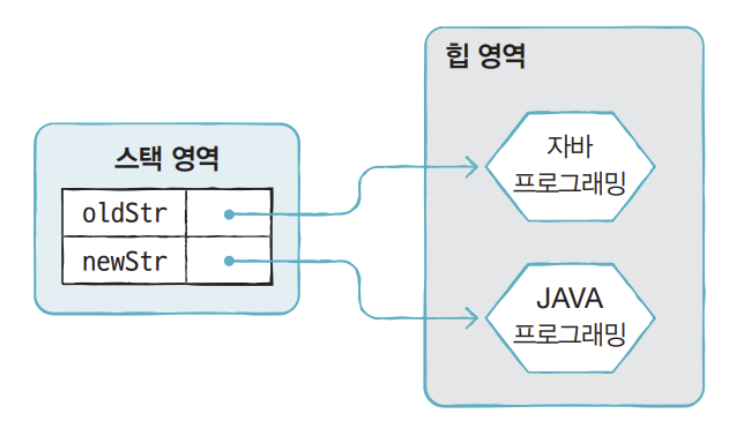

# Java 문법

[장점]
1. **Simple**
    - C, Cpp의 포인터와 같은 복잡한 특징 제거

2. **Object-oriented Language**
    - 이전의 언어와 다르게 쉽게 실행하고 안전
    - 하나이 기능을 객체형태로 만들어 객체들을 결합해 하나의 프로그램을 만드는 방식<br>
    e.g. <br>
        - 컴퓨터 = 완성품<br>
        - CPU, 메모리 등 = 객체

<details>
<summary>객체지향 4대 특징</summary>

## **1. Encapsulation(캡슐화)**
- 관련 기능, 데이터를 하나의 클래스로 묶어서 사용하는 법
- 정보 은닉
- public(+): 클래스 외/내부에서 접근 가능
- protected(#): 해당 객체를 상속받은 객체 내부에서 접근 가능(단순 인스턴스에선 접근 불가)
- default: 동일한 패키지 내의 객체에서 인스턴스를 생성하여 접근 가능
- private(-): 클래스 내부에서는 접근 가능 But 외부에서는 접근 불가

## **2. Inheritance(상속)**
- extends(재사용), 부모 클래스에서 선언한 변수나 메소드를 상속받음
- Java의 모든 class는 Object 클래스의 후손
- 부모클래스의 생성자, 초기화 블록은 상속되지 않음
- 부모의 private 멤버는 상속되지만 직접 접근 불가
- **단일 상속만 지원**
- **Is a(상속 관계)**: 자식 클래스는 (하나의) 부모 클래스
- **Has a(연관 관계)**: 한 클래스 멤버 변수로 다른 클래스 타입의 참조변수 선언

## **3. Abstraction(추상화)**
- 객체에서 공통된 속성, 행위 추출
- 유연성 확보를 위해 구체적인 것은 제거한다는 뜻
- 프로그램에서 필요한 공통점을 추출하고, 불필요한 공통점을 제거하는 과정

## **4. Polymorphism(다형성)**
### **Overriding**
- 관련된 기능, 데이터를 하나의 클래스로 묶어서 사용하는 법(= Encapsulation)
- 메소드 헤드라인 위에 반드시 **Annotation, @Override** 표시
- 부모 클래스와 자식 클래스 메소드를 비교하여 메소드 이름이 동일하거나 매개변수 개수, 타입, 순서가 동일하다면 메소드 재정의 가능<br>
(단, 접근제어자 private를 사용하면 불가능)

### **OVerloading**
- 한 클래스 내에서 같은 이름의 메소드를 여러 개 정의하는 것
- 같은 메소드 이름, 다른 매개변수 선언 조건이어야 사용 가능

</details>

3. **Safe Language**
    - 포인터를 사용하는(c, cpp)는 메모리 접근을 허락 So, 보안상 위험이 될 수 있음
    - System, 하드웨어 상관없이 어느 장치에서나 실행

4. **Independent Language**
    - **어떠한 운영체제라도 독립적으로 자바 언어 사용 가능**
    - JVM에 의해서 실행되기 때문

5. **Auto Memory Manager**
    - 개발자가 직접 메모리에 접근 불가 -> 자바가 직접 관리
    - 이말은 **객체 생성 시 자동적으로 메모리 영역을 찾아서 할당** 또한 사용하지 않는 객체를 제거해줌

6. **Multi Threding**
    - 하나의 프로그램 단위가 동일한 쓰레드를 동시에 수행 가능
    - OS마다 멀티 쓰레드를 이용하는 API가 다름
    - But Java는 JavaAPI를 사용해 쉽게 구현 가능

7. **Dynamic**
    - 객체간의 상호 작용을 정의 -> 필요하지 않는 객체는 생성되지 X
    - If 오류가 발생 -> 오류 클래스만 수정하면됨
    - 즉, **유지보수가 쉽고 빠르게 진행 가능**


## 목차
1. [조건문](#조건문)
2. [반복문](#반복문)
3. [배열](#배열)
4. [문자열](#문자열)


## 조건문

1. **for문**

```java
a = 1;
b = 2;
if(a > b){
    System.out.println("A가 B보다 큼");
}
else if(a < b){
    System.out.println("B가 A보다 큼");
}
else{
    System.out.println("A와 B는 같음");
}
```

2. **삼항연산자**

```java
a = 1; b = 2;
System.out.println(a > b ? "A가 큼" : a < b ? "B가 큼" : "A와 B는 같음");
```

3. **switch문**

```java
// 시험 성적 문제
Scanner sc = new Scanner(System.in);
int score = sc.nextInt();
char grade;
switch(sc / 10){
    case 10:
    case 9:
        grade = 'A';
        break;
    case 8:
        grade = 'B';
        break;
    case 7:
        grade = 'C';
        break
    default:
        grade = 'F';
}
System.out.println(grade);
```

-----

## 반복문

1. **for문**
    - for(초기화식; 조건식; 증감식){실행문;}
    - **조건식:** 조건식 전까지

```java
    int sum = 0;
    for(i = 1; i <= 10; i++){
        sum += i;
    }
```
2. **while문**
    - while(조건식){실행문;}
    - 주로 비교 & 논리 연산식에 사용
    - for문과 다르게 초기화식은 밖에, 증감식은 안에

```java
    int sum = 0;
    int i = 1;
    while(i <= 10){
        sum += i;
        i++;
    }
```

3. **do-while문**
    - do {실행문} while (조건식);  // 조건식이 뒤, 조건식이 true일 경우 반복, false일 경우 중단
    - do문을 먼저 검증 후 while문 안에 로직 실행
    - **즉, 실행 후 로직 검사**
```java
    int sum = 0;
    int i = 1;
    do{
        sum += i;
        i++;
    }while(i <= 10);
```

4. **break-label**
    - 이중 반복문에서 특정 조건이 만족할 때 반복문 종료

```java
// label을 Outter로 선언 -> 변수 값이 소문자 g가 되면 반복문 종료
Outter:
for(char upper='A'; upper <='Z'; upper++){
    for(char lower='a'; lower <='z'; lower++){
        System.out.println(upper + '-' + lower);
        if(lower=='g'){
            break Outter;
        }
    }
    System.out.println("프로그램 종료");
}
```
```
[결과]
A - a
A - b
A - c
A - d
A - e
A - f
A - g
프로그램 종료
```
-----

## 배열
- **배열**이란? 고정된 개수의 단일 타입 값들을 담고 있는 객체
- **배열의 요소(components; 컴포넌트)**: 배열에 들어있는 변수들
- **배열 요소의 타입(components type)**: 모든 요소들이 가지는 같은 타입
- If 배열에 n개(**배열의 길이**)의 요소 then 각 요소는 **0 ~ n-1까지**의 정수 인덱스를 가짐
- **배열이 생성된 이후에는 길이가 고정**
- **선언:** 타입[ ]변수; or 타입 변수 [ ]; <br>
    e.g. int[] intArray;
- 배열도 객체이므로 힙 영역에 생성되고 배열 변수는 힙 영역의 배열객체를 참조<br>
    -> 참조할 배열 객체가 없다면? 배열 변수는 null 값으로 초기화 가능<br>
- 배열 변수는 참조변수에 속함


- **생성**: 값목록 이용방법 or new 연산자 이용
    1. 값 목록으로 배열 생성<br>
        ```java
        // 가능
        int[] intArray = {0, 1, 2, 3};
        // 불가능
        int[] intArray;
        intArray = {0, 1, 2, 3}; # 컴파일 에러
        ```
    2. new 연산자<br>
    2-1. 배열 변수를 미리 선언한 후 값 목로글이 나중에 결정된다면?<br>
    - new 연산자를 사용해 값 목록 지정
    ```java
    int[] intArray = null;
    intArray = new int[]{0, 1, 2, 3};
    ```

    2-2. 메소드의 매개값이 배열일 경우?<br>
        -> 매개 변수로 배열이 선언된 add() 메소드가 있을 경우 값 목록 생성과 동시에 add()메소드의 매개값으로 사용하고자 할때는 반드시 new 연산자 필요
    ```java
    int add(int[]scores){...};
    int res = add({95, 85, 90}); //컴파일 에러
    int res = add(new int[]{95, 85, 90});
    ```

    2-3. 값의 목록은 없지만 향후 값들을 미리 저장할 배열 만든다면?
    ```java
    int[] intArray = new int[5];
    ```

- **타입별 배열 초기값**


### **Arrays 클래스(java.utils.Arrays):**<br>

#### 1. 문자열로 변환 **Arrays.toString(int[] arr)**<br>
문자열로 변환 -> **배열을 반복문을 사용하지 않고 출력하기 위함**
    ```java
    int[] intArray = {0, 1, 2, 3, 4, 5};
    System.out.println(Arrays.toString(intArray));
    ```

- 2차원 배열일 경우: **Arrays.deepToString(Object[]arr)** 
    ```java
    int [][] arr = {{0,1,2,3}{4,5,6,7}};
    //toString 사용
    System.out.println(Arrays.toSring(arr[0]));
    System.out.println(Arrays.toString(arr[1]));
    // 출력값
    // [0, 1, 2, 3]
    // [4, 5, 6, 7]

    //deepToString 사용
    System.out.println(Arrays.deepToString(arr));
    //출력값: [[0,1,2,3], [4,5,6,7]]
    ```

#### 2. 정렬 **Arrays.sort(int[]arr)**<br>
2-1 오름차순 정렬

    ```java
    int[] arr = {4, 3, 1, 2, 5};
    Arrays.sort(arr);
    //arr -> [1, 2, 3, 4, 5]
    ```

2-2 내림차순 정렬<br>
**Collections.reverseOrder()** 사용<br>
Collections는 Object를 상속하는 클래스에서 사용 가능한 인터페이스
- int, long, double, char 같은 기본 타입 -> Integer, Long, Double, Character

    ```java
    Integer [] arr = {4, 3, 1, 2, 5};
    Arrays.sort(arr, Collections.reverseOrder());
    //arr -> [5, 4, 3, 2, 1]
    ```

2-3 2차원 배열 정렬<br>
배열을 직접 지정해줘야함

```java
Integer [][] arr = {{1, 3, 2}, {5, 6, 4}};
Arrays.sort(arr[0]); // arr -> [[1, 2, 3], [5, 6, 4]]
Arrays.sort(arr[1]); // arr -> [[1, 2, 3], [4, 5, 6]]
Arrays.sort(arr[0], Collections.reverseOrder());
Arrays.sort(arr[1], Collections.reverseOrder());
```

#### 3. 특정값 채우기: **Arrays.fill(int[]arr, int value)**

    ```java
    int[] arr = new int[3];
    Arrays.fill(arr, 7);
    // arr -> [7, 7, 7]
    ```

3-1 2차원 배열<br>

```java
int[]arr = {0, 1, 2, 3, 4};
int[][] arr2 = new int[3][5];
Arrays.fill(arr2, arr);
// arr2 -> [[0, 1, 2, 3, 4], [0, 1, 2, 3, 4], [0, 1, 2, 3, 4]]
// 만약 숫자를 채운다면 배열을 지정해주어야함
```


#### 4. 값 비교: **Arrays.equal(int[]arr, int[]arr2)<br>
주솟값이 같은 것은 아니기에 == 을 하면 false가 나옴<br>
-> 배열은 참조변수에 속하기 때문

```java
int [] arr = {0, 1, 2, 3};
int [] arr = {0, 1, 2, 3};
System.out.println(arr == arr2); // false
System.out.println(Arrays.equals(arr, arr2)) // true
```


#### 5. 리스트로 변환: **Arrays.asList(Integer [] arr)**

```java
    Integer[] arr = {0, 1, 2, 3};
    List<Integer> arrList = Array.asList(arr);
    System.out.println(arrList);
    //[0, 1, 2, 3]
```

#### 6. 배열 복사: **Arrays.copyOf(int[] arr, int newLength)**<br>
배열을 특정 길이만큼 복사 -> 입력 받은 길이 > 배열 길이 -> 기본값 채워짐

```java
int[] arr = {0, 1, 2, 3};
int[] arr2 = Arrays.copyOf(arr, 5);
System.out.println(Arrays.toString(arr2));
// 결과: [0, 1, 2, 3, 0]
int[] arr3 = Arrays.copyOf(arr, 3);
System.out.println(Arrays.toString(arr3));
// 결과: [0, 1, 2]
```

#### 추가
<details>
<summary> 추가정보 </summary>

- 배열이 메모리 상에서 연속적으로 위치하지 않아도된다.
    ```
    JLS에서는 배열이 객체
    동시에 JVMS에서는 배열과 객체가 JVM에 힙에 저장된다고 함
    그러나 JVMS는 힙 메모리가 연속적일 필요가 없다
    즉, 모든 배열이 힙에 저장되고 힙이 연속이지 않을 수 있으므로 배열도 연속적이지 않을 수 있다.
    ```
- **JLS(Java Language Specification)**: 자바 언어 명세서

- **JSR(Java Specification Request)**
: JCP(자바 커뮤니티 프로세스)의 새 명세를 위해 구성된 팀원들에 의해 만들어진 문서

- **JEP(Java Enhancement Proposal; 자바 강화 제안)**: 
: 자바 코어 기술을 강화하기 위한 제안 문서

- **JVM(Java Virtual Machine)**: 자바를 실행하기 위한 가상 기계

Java는 OS에 종속적이지 않다 -> 그러면 실행되려면? -> JVM이 필요
**즉, OS에 종속받지 않고 CPU가 Java를 인식, 실행할 수 있게 하는 가상 컴퓨터**

```
Java 소스코드(*.java)는 CPU가 인식 불가 -> 
Java Compiler(JDK 설치시 bin에 존재하는 javac.exe)가 JVM이 인식 가능한 Java bytecode(JVM이 이해할 수 있는 언어로 변환된 자바 소스코드)로 변환(*.class) ->
JVM이 OS가 이해 가능하도록 Java bytecode를 해석 
```
</details>


## 문자열


1. **문자 추출(charAt())**
- 주어진 인덱스의 문자 리턴

```java
String subject = "자바 프로그래밍";
char charValue = subject.charAt(3); //프
```

2. **문자열 비교(equals())**
- 기본타입(byte, char, short, int, long, float, double, boolean) 변수 값을 비교할 때에는 == 연산자 사용
- 문자열 비교하면 다른 결과가 나올 수 있음<br>
    - 아래 예제에서 str1과 str2(= str3)는 다른 String 객체를 참조
```java
String str1 = new String("자바");
String str2 = "자바";
String str3 = "자바";
str1 == str2 // false
str2 == str3 // true
```

- 두 String 객체의 문자열만 비교하고 싶다면 아래와 같이 사용
- equals()는 Object클래스이 번지 비교 메소드이지만, String 클래스가 재정의하여 문자열 비교하도록 변경함

```java
str1.equals(str2) // true
str2.equals(str3) // true
```

3. **문자열 찾기(indexOf())**
- 매개값으로 주어진 문자열이 시작되는 인덱스 리턴
- **주어진 문자열이 포함되어 있지 않으면 -1 리턴**

```java
String subject = "자바 프로그래밍";
int idx = subject.indexOf("프로그래밍"); // index = 3
```

- if문의 조건식에서 특정 문자열 포함 여부에 따라 실행하는 코드에서 사용

```java
if(문자열.indexOf("찾는 문자열") != -1){
    //포함된 경우
}else{
    //포함되지 않는 경우
}
```

4. **문자열 길이(length())**
- 문자열 길이 리턴(공백 포함)

```java
String subject = "자바 프로그래밍";
int length = subject.length(); // length = 8
```

5. **문자열 대치(replace())**
- 첫번째 매개값을 찾아 두 번째 매개값인 문자열로 대치
- **String 객체의 문자열은 변경 불가능**
- So, 메소드가 리턴한 문자열은 완전히 새로운 문자열



```java
String oldStr = "자바 프로그래밍"
String newStr = oldStr.replace("자바", "JAVA");
```

6. **문자열 잘라내기(substring())**
- 주어진 인덱스에서 문자열 추출
- 매개값이 한개이면 매개값 ~ 끝까지
- 매개값이 두개이면 first 매개값 ~ second 매개값

```java
String ssn = "000101-1234567";
String firstN = ssn.substring(0,6);
// firstN = 000101
String secondN = ssn.substring(7);
// secondN = 1234567
```

7. **알파벳 소.대문자 변경(toLowerCase(), toUpperCase())**
- 문자열 대치와 같이 기존 값이 변경되는 것이 아님

```java
String original = "Java Programming";
String lowerCase = origin.toLowerCase();
String upperCase = origin.toUpperCase();
```


8. **문자열 앞뒤 공백 잘라내기(trim())**
- 문자열 앞뒤 공백을 제거한 새로운 문자열 생성 & 리턴
- 중간 공백은 재거하지 않음
- 기존 값의 공백을 제거하는 것이 아님

```java
String oldStr = " 자바 프로그래밍 ";
String newStr = oldStr.trim();
```

