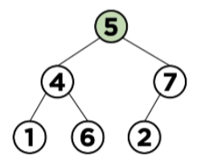

# [자료구조] 힙(Heap)

## 힙이란?
1. 자료 구조 힙(Heap)
2. Java의 메모리 영역(CS 카테고리 중 OS 부분에서 나옴)

### 자료구조 힙
- 이진 힙(Binary Heap)이라고도 하고, **최댓값, 최솟값을 찾아내는 연산**을 빠르게 하기 위해 고안된 **[완전 이진 트리](Tree.md)**를 기본으로 한 자료구조<br>

**특징**
1. 완전 이진트리 구조
2. 부모 노드의 키값과 자식 노드의 키값 사이에는 대소 관계가 성립
    - 키값 대소 관계는 오로지 부모 자식 간에만 성립되며 형제 노드 사이에는 성립되지 않는다는 뜻

=> ***최솟값 또는 최댓값을 빠르게 찾아내기 위한 완전 이진 트리 형태로 만들어진 자료구조**

**Max Heap**
    - 부모 키값 > 자식 노드 키값
    - Max Heap: 부모 노드의 값은 항상 자식 노드보다 크거나 같을 때를 의미
    - 즉, **루트 노드 = 트리의 최댓값**


**Min Heap**
    - **부모 키값이 자식 노드 키값보다 작은 힙**
    - Min Heap: 부모 노드의 값은 항상 자식 노드보다 작거나 같을 때를 의미
    - 즉, **루트 노드 = 트리의 최솟값**


- 새로운 노드가 추가되더라도 구조가 항상 유지되어야 하고, **좌우 노드에 대한 크기는 신경 쓰지 않고, 상하 관계의 크기만을 신경 쓴 구조**

- **'부모 노드는 항상 자식 노드보다 우선 순위가 높다"**를 의미
- 즉, **root node는 항상 우선순위가 더 높은 노드다**
- So, 최댓값과 최솟값을 빠르게 찾아낼 수 있다는 장점(시간 복잡도: O(1))
- 삭제/삽입 연산시에도 부모 노드가 자식노드보다 **우선 순위**만 높으면 됨
- 결국 트리의 깊이만큼만 비교하면 됨 So, 시간 복잡도 = O(log_(2)n)

### **Heap을 배열로 표현**
: 힙은 중간에 **빈 값이 존재하지 않는 완전 이진 트리** So, 일차원 배열로 표현해도 문제 X
- [Tree](Tree.md) 구조에서 설명한 노드 탐색의 용이성 때문에 index부터 루트 노드의 데이터를 채움


### **Heapify - 데이터 상향(or 하향) 재정렬**
※ 최대 힙을 예로 설명
- 일반 트리 구조에서 힙 구조를 만들거나
- 힙의 구조에서 특정 상황에 따라 힙의 재구조화를 해야할 때가 존재
- 이 연산 = **heapify**연산
- 이를 통해 데이터의 추가/삭제 후에도 힙의 속성을 유지하는 것을 도와줌
e.g. 아래 사진과 같은 힙 구조가 있다.(Min Heap 기준)


- If 데이터 1을 추가 -> 루트 노드가 1로 바뀌어야 Min Heap 구조 유지 -> 힙의 재구조화가 필요
- If 데이터 3을 제거 -> 루트 노드가 5로 바뀌어야 힙 구조 유지 -> 재구조화 필요

### **힙 구조화 - Build Heap**
: 완전 이진 트리 구조에서 heap 구조를 만드는 작업


- 배열에 표현된 힙은 루트 노드의 index가 1이라고 할때,
- n/2 + 1 ~ n 까지는 모두 leaf 노드라는 속성을 보유
- leaf 노드를 제외한 나머지 노드(1 ~ n/2)에 heapify를 수행 -> heap 구조화 진행 가능

### **힙에 데이터 삽입**
- **Min heap에 데이터 '1' insert**
    1. 완전 이진 트리 형태 유지를 위해 우선 leaf 노드에 삽입
    2. 힙 조건 만족 확인
        - 만족한다면 종료<br>
    3. 만족하지 않으면 삽입 노드(1)와 해당 노드의 부모 노드의 값을 바꿈

[과정(왼쪽 ~ 오른쪽)]


### **힙에 데이터 삭제**


- **Max Heap에서 최댓값 '9' 삭제하기**
    1. 마지막 노드(5)를 root node로 가져옴
    2. heap 조건을 만족하는지 확인
        - 만족한다면 종료<br>
    3. 만족하지 않는다면 <U>자식 노드</U>와 위치 변경

 

### **장단점**
[장점]
1. 최악의 경우에도 O(nlog_(2)n)으로 유지
2. heap 특성상 **부분 정렬**할 때 효과가 좋음

[단점]
1. 일반적인 O(nlog_(2)n) 정렬 알고리즘에 비해 성능은 약간 떨어짐
2. 한 번 MaxHeap을 만들면서 불안정 정렬 상태에서 최댓값만 가지고 정렬 So, 안정 정렬이 아님

### **Heap 구현**

<details>
<summary>구현 코드</summary>

- **IHeap Interface**
: 필요 프로토타입 선언<br>
최대 힙과 최소힙은 부호만 반대로 하면 됨 So, MaxHeap만 구현

```java
package heap;

public interface IHeap<T> {
    void insert(T val);

    boolean contains(T val);

    T pop();

    T peek();

    int size();
}

package heap;

public class MaxHeap<T extends Comparable<T>> implements IHeap<T> {
    ...
}
```

- **멤버변수, 생성자**
: 데이터 배열의 1번 index부터 삽입 -> 크기를 maxSize+1로 설정

```java
// 멤버 변수
T[] data;
int size;
int maxSize;

// 생성자
public MaxHeap(int maxSize) {
    this.maxSize = maxSize;
    this.data = (T[]) new Comparable[maxSize + 1];
    this.size = 0;
}
```

- **부모/자식 노드 찾는 메소드**
: 트리 구조를 배열로 나타냈을 때 index를 통해 특정 노드 위치를 찾을 수 있음

```java
private int parent(int pos) {
    return pos / 2;
}

private int leftChild(int pos) {
    return pos * 2;
}

private int rightChild(int pos) {
    return (2 * pos) + 1;
}
```

- **leaf 노드 판별 메소드**
: 배열에 표현된 힙은 루트 노드의 index가 1이라고 할 때, n/2 + 1(중간에서 다음 칸) 부터 n(마지막 노드) 까지는 모두 leaf 노드

```java
private boolean isLeaf(int pos) {
    return (pos > (size / 2) && pos <= size);
}
```

- **insert(T val)**
: leaf에 데이터를 삽입 -> 값 위치 찾아주는 연산 진행
    - 삽입할 val를 data 배열에 넣어줌
    - current: 현재 데이터를 삽입한 위치
    - 부모 노드 != null & current 인덱스 값 > current 노드의 parent 값 -> 위치 서로 변경
        - java api Collections의 swap 메소드 사용<br>
    - 계속해서 바뀐 노드 위치가 힙의 조건을 만족하는 지 확인하기 위해 current 변수에 parent값을 넣으면서 반복

```java
@Override
public void insert(T val) {
    this.data[++this.size] = val;

    int current = this.size;

    while (this.data[parent(current)] != null &&
          this.data[current].compareTo(this.data[parent(current)]) > 0 {
              Collections.swap(Arrays.asList(this.data), current, parent(current));
              current = parent(current);
          })
}
```

- **pop() / heapify(int idx)**
    1. pop()
    - 삭제 연산: root 노드 값 삭제 -> root node 값 가져오기(index = 1)
    - 이진 트리 만족을 위해 가장 마지막 값을 가여와야함 -> size index에 해당하는 값을 root node 위치에 가져오고 size--
    - return root node(top)
    
    2. heapify()
    - leaf node인 경우 종료
    - current, left, right 값을 각각 가져옴
    - left 자식 노드와 right 자식 노드 중 어느 것이라도 current 값보다 크면
        - left와 right 중 더 큰 노드와 비교해 더 큰 것과 교환
        - 바꾸고 나서 heap 조건 만족 여부 확인(재귀 호출) -> 조건 만족할 때까지 진행

```java
// pop
@Override
public T pop() {
    T top = this.data[1];//루트 노드 값

    this.data[1] = this.data[this.size--];
    heapify(1);

    return top;
}


// heapify
private void heapify(int idx) {
    if(isLeaf(idx)) {
        return;
    }

    T current = this.data[idx];
    T left = this.data[leftChild(idx)];
    T right = this.data[rightChild(idx)];

    if (current.compareTo(left) < 0 || current.compareTo(right) < 0) {
        if (left.compareTo(right) > 0) {
            Collections.swap(Arrays.asList(this.data), idx, leftChild(idx));
            heapify(leftChild(idx));
        } else {
            Collections.swap(Arrays.asList(this.data), idx, rightChild(idx));
            heapify(rightChild(idx));
        }
    }
}
```

- **contains(T val)**
: BST(이진 탐색 트리)와 다르게, 값을 비교하면서 Child를 타고 내려가는 것 x
-> for문을 통해 값 비교
    - 1번 index부터 for문 진행
    - data에 val 존재 -> true, else -> false 리턴

```java
public boolean contains(T val) {
    for (int i = 1; i < this.size; i++) {
        if (val.equals(this.data[i])) {
            return true;
        }
    }
    return false;
}
```

- **peek()**
: 가장 최상위 값인 루트 노드의 값을 가져옴

```java
@Override
public T peek() {
    if (this.size < 1)
        throw new RuntimeException();
    return this.data[1];
}
```

- **size()**
: 사이즈 리턴하는 메소드

```java
@Override
public int size() {
    return this.size;
}
```
</details>

### [정렬 간 시간 복잡도]

