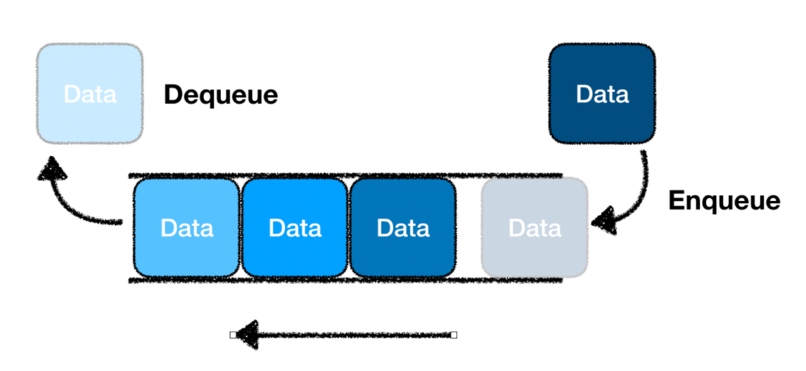
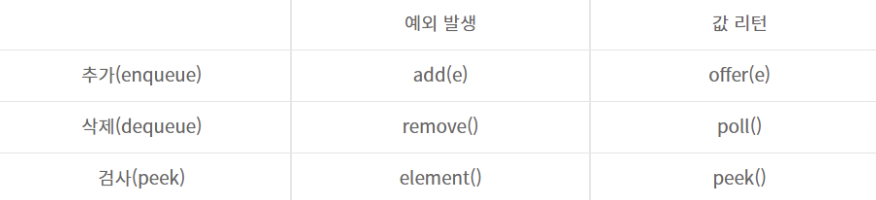
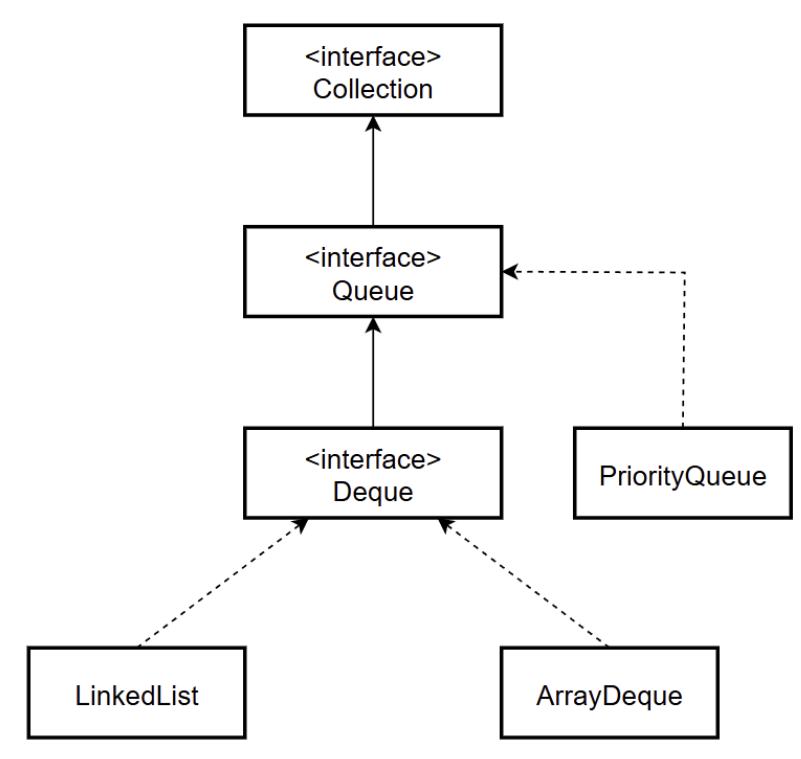

# [자료구조] Queue

## **Queue란?**
- **사전적 의미**: 무엇을 기다리는 사람
- **줄을 지어 순서대로 처리되는 것**
- 데이터를 일시적으로 쌓아두기 위한 자료구조로 Stack(LIFO)과는 다르게 **FIFO의 형태**



### **특징**
- **FIFO구조**
- 한 쪽 끝은 front로 정해 **삭제 연산**만 수행
- 다른 쪽 끝은 rear로 정해 **삽입 연산**만 수행
- **BFS(넓이 우선 탐색)**에 사용: 그래프, 트리의 탐색 알고리즘에서 활용
- 컴퓨터 **버퍼**에 주로 사용

### **사용**
- **작업 스케줄링**: 순차적 처리
- **BFS**: 그래프, 트리 탐색
- **데이터 스트리밍**: 실시간 데이터 스트리밍
- **메시지 대기열**: 인쇄 작업을 순서대로 처리할 때(비동기 작ㅇㅂ의 순차적 처리)

### **장단점**
#### **장점**
1. **FIFO**: 특정 작업을 처리하는 순서 보장하는 데 유용
2. **크기 조절**: 동적으로 크기를 조절 가능
3. **대기열 관리**: 처리 우선 순위에 따라 처리할 수 있음

#### **단점**
1. **중간 항목 접근 어려움**: 특정 항목을 삭제하기 위해 그 앞에 위치한 모든 항목들을 먼저 삭제해야 함.
2. **크기 제한**: 동적 조절이 가능하지만, 특정 구현에서 크기가 제한되어 있을 수 있음 -> 가득찬 상태에서 더 많은 항목을 삽입하려고 하면 Overflow 발생 가능
3. **선형 탐색 시간**: 특정 항목을 찾기 위해 queue를 선형적으로 탐색해야 함. So, 걸리는 시간은 Queue size에 비례


### **기본 연산**
#### **예외 처리를 유연하게 할 수 있는 메소드: offer(), poll(), peek()**
- **add(E e)**: 요소를 Queue 끝에 추가, 가득차면 llegalStateException 발생
- **offer(E e)**: 요소를 Queue 끝에 추가, 공간이 없으면 false 반환
- **remove()**: Queue의 앞 요소 제거 & 반환, 큐가 비면 NoSuchElementException 발생
- **poll()**: Queue의 앞 요소 제거 & 반환, 큐가 비면 null 반환
- **element()**: Queue의 앞 요소 반환, 큐가 비면 NoSuchElementException 발생
- **peek()**: Queue의 앞 요소 반환, 큐가 비면 null 반환
- **isEmpty()**: 빈 여부 확인
- **size()**: 현재 크기 반환
- **clear()**: Queue의 모든 요소 제거



### **Queue의 구현 클래스들**
Queue 인터페이스를 구현한 여러가지 클래스로 자주 사용되는 몇 가지만 정리


#### **LinkedList**
- **Queue**와 **Deque** 인터페이스 구현
- **양방향 연결 리스트**기반으로 요소 관리
- Queue의 앞과 뒤에서의 삽입 및 삭제가 빠름 → 대기열 작업 or 작업 큐의 역할을 할 때 적합
```java
Queue<String> queue = new LinkedList<>();
queue.offer("첫 번째 요소");
queue.offer("두 번째 요소");
System.out.println(queue.poll());  // 출력: 첫 번째 요소
System.out.println(queue.peek());  // 출력: 두 번째 요소
```

#### **ArrayDeque**
- **Queue**와 **Deque** 인터페이스 구현
- **배열** 사용하여 큐를 구현
- Stack과 queue 두 개의 기능을 모두 제공
- **null 요소 허용 x**, **동적 배열**을 사용해 효율적 요소 관리
- LinkedList보다 빠른 성능 So, Stack과 queue의 대체로 자주 사용

```java
Queue<String> queue = new ArrayDeque<>();
queue.offer("A");
queue.offer("B");
System.out.println(queue.poll());  // 출력: A
```

#### **PriorityQueue**
- natural ordering 또는 지정된 비교자에 따라 정렬된 상태를 유지하는 우선순위 큐
- 숫자가 작은 대로 처리 or 특정 기준에 따라 높은 우선 순위의 작업부터 처리하고자 할 때 사용

```java
Queue<Integer> priorityQueue = new PriorityQueue<>();
priorityQueue.offer(10);
priorityQueue.offer(5);
priorityQueue.offer(20);
System.out.println(priorityQueue.poll());  // 출력: 5 (작은 수부터 정렬됨)
```

#### **BlockingQueue**
- **동시성 프로그래밍**을 위해 제공되는 특별한 종류의 큐
- java.util.concurrent 패키지에 속함
- 생산자-소비자 패턴과 같은 **멀티 스레드 환경**에서의 작업 처리에 유용
- 대표적인 예: **ArrayBlockingQueue**, **LinkedBlockingQueue**

#### **ArrayBlockingQueue**
- **고정 크기 배열** → 생성 시 크기 지정 필요
- Queue가 가득 찼을 때 추가 작업을 블록, 비어있을 때 제거작업을 블록

```java
BlockingQueue<Integer> blockingQueue = new ArrayBlockingQueue<>(2);
blockingQueue.put(1);
blockingQueue.put(2);
System.out.println(blockingQueue.take()); // 출력: 1
```

#### **LinkedBlockingQueue**
- **연결 리스트 기반**의 Queue
- 크기 지정을 하지 않으면 기본적으로 Integer.MAX_VALUE 만큼의 요소 가질 수 있음
- 요소의 추가, 제거 작업이 동시에 일어나도 안전하게 사용 가능

```java
BlockingQueue<String> linkedBlockingQueue = new LinkedBlockingQueue<>();
linkedBlockingQueue.put("데이터 1");
linkedBlockingQueue.put("데이터 2");
System.out.println(linkedBlockingQueue.take());  // 출력: 데이터 1
```


### **Queue 사용 시 주의 사항**
1. **동기화 문제**
- 일반적인 Queue Class(LinkedList, PriorityQueue 등)는 동기화 지원 X<br>
  → **멀티 스레드 환경**에서 안전하지 않음<br>
- **멀티 스레드 환경**에서 사용할 경우<br>
  → **Blocking Queue**, **Collections.synchronizedQueue**와 같은 동기화된 queue 사용을 추천

2. **Null 요소 금지**
- 대부분의 자바 Queue 구현체(PriorityQueue, ArrayDeque 등)는 null 요소 허용 x
why? null값이 반환될 때, **큐가 빈 건지**, 실제로 **null값 저장**인지 구분 불가하기 때문

### 구현

#### **enqueue(E item) - 요소추가**
```java
public void enqueue(T item) {
    Node<T> newNode = new Node<>(item);
    if (rear != null) {
        rear.next = newNode;
    }
    rear = newNode;
    if (front == null) {
        front = rear;
    }
    size++;
}
```
#### **dequeue() - 큐에서 요소 제거 및 반환**
```java
public T dequeue() {
    if (isEmpty()) throw new IllegalStateException("empty");
    T data = front.data;
    front = front.next;
    if (front == null) {
        rear = null;
    }
    size--;
    return data;
}
```
#### **peek() - 큐의 front 요소 조회**
```java
public T peek() {
    if (isEmpty()) throw new IllegalStateException("empty");
    return front.data;
}
```