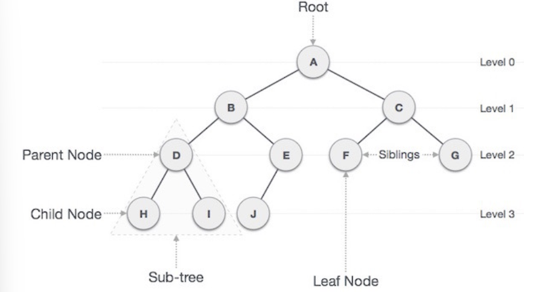

# [자료구조] 힙, 큐(Heap & Queue)

## 힙이란?
1. 자료 구조 힙(Heap)
2. Java의 메모리 영역(CS 카테고리 중 OS 부분에서 나옴)

### 자료구조 힙
- 이진 힙(Binary Heap)이라고도 하고, **최댓값, 최솟값을 찾아내는 연산**을 빠르게 하기 위해 고안된 **완전 이진 트리**를 기본으로 한 자료구조 

이진트리

### **트리란?**
- 노드들이 나무 가지처럼 연결된 **비선형(non-linear)**, **계층적** 자료 구조
- 한 노드가 여러 노드를 가르킬 수 있는 비선형적 자료구조
- List, Stack, Queue는 이전 데이터와 다음 데이터간의 순서가 존재
- But 트리 구조 특성상 순서는 그렇게 중요하지 않음
- **그래프의 일종**이며 데이터 구조의 **상하 개념 계층의 구조적 속성을 표현**한다는 특징이 있음

### **용어**

- **Node**: 트리 구조에서 각 **구성요소**(A ~ J)
- **Root Node**: 트리 시작 노드, 부모가 없는 **최상위 노드(A)
- **Edge**: 노드와 노드를 연결하는 선
- **Path**: 특정 노드에서 노드까지의 **경로**(순서)
- **Treminal Node(Leaf Node)**: **자식 노드가 존재하지 않는** 노드(H,I,J,F,G)
- **Sub-Tree**: 전체 큰 트리 구조 안의 작은 트리 구조 
    - 트리의 **재귀**적인 특성을 보여줌 
- **Depth**: **Root Node**로부터 얼마나 떨어져 있는 지를 뜻하는 단위 
    - 루트 노드의 바로 아래 노드의 depth = 1 
- **Level**: **같은 depth**를 가지는 노드들을 한 레벨로 나타내는 단위 
    - Root Node 기준, 이 위치를 level 0으로 잡음 
    - 루트 노드에서 어떤 노드까지의 **간선 수** 
- **Height**: 트리에서 가장 **최고 레벨**, 가장 깊은 층
- **Order**: 부모 노드에서 가질 수 있는 **최대 자식 수** 
    - e.g. If order 4 -> 부모 노드는 최대 3명의 자식 노드를 가질 수 있음 

**특징**
1. 완전 이진트리 구조
2. 부모 노드의 키값과 자식 노드의 키값 사이에는 대소 관계가 성립
    - 키값 대소 관계는 오로지 부모 자식 간에만 성립되며 형제 노드 사이에는 성립되지 않는다는 뜻

