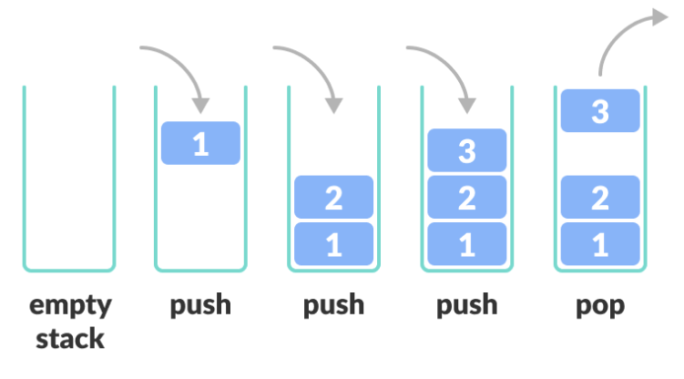
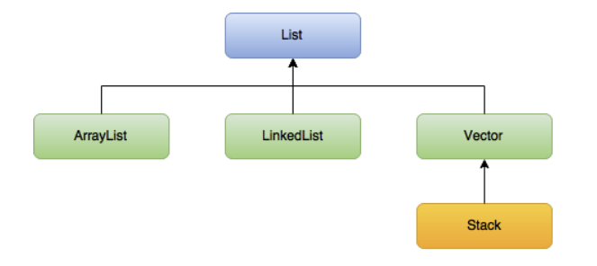

# [자료구조] 스택(Stack)

## 스택이란?

```
한쪽 끝에서만 데이터를 넣고 뺄 수 있는 제한적으로 접근 가능한 후입선출(LIFO)형태의 선형 자료 구조
```
|            Stack            |              Stack 상속 구조                |
|:---------------------------:|:------------------------------------------:|
||

## Stack 사용처?
- 총기류 탄창: 마지막에 넣은 총알이 가장 먼저 발사
- 수식 계산, 수식 괄호 검사, undo/redo, 뒤로/앞으로(웹)

## 특징
- **LIFO 구조**
- **단방향 입출력 구조**: 들어오고 나가는 방향 동일
- 데이터를 하나씩만 넣고 뺄 수 있음
- **DFS(깊이 우선 탐색)에 이용**
- 재귀 함수의 동작 흐름과 같은 구조

## 선언
- import java.util.Stack 필요
- **Stack<T> 스택이름 = new Stack<>();** 
- T(데이터 타입)은 클래스 또는 래퍼 클래스로 선언 가능

## 값 추가 및 제거
- **push 메서드**: 값을 하나씩 추가
- **pop() 메서드**: 값을 하나씩 제거 + 해당 값 반환
- **clear() 메서드**: 모든 값 제거, 반환 값 X
- **peek() 메서드**: 스택의 마지막 요소 반환(스택에 변화 X)<br>
※ If 스택 비어있음 -> peek() 호출 -> NoSuchElementException 예외 발생
- **isEmpty() 메서드**: 스택의 비어있는지 여부, 반환값(true | false)
- **search() 메서드**: 인자를 스택에서 검색해 해당 위치 반환, 인자가 여러개일 경우, 마지막 위치를 반환(**위치 = 빠져나오는 순서**)<br>
※ If 찾는 값이 스택에 없음 -> -1 반환

```java
Stack<Integer> stackInt = new Stack<>();

stackInt.push(1);
stackInt.push(2);
stackInt.push(3);
// 1, 2, 3 순으로 값 추가 
System.out.println(stackInt.isEmpty) // 값이 차있으므로 false 출력

// 값 제거
stackInt.pop();
stackInt.pop();
stackInt.pop();
// 3, 2, 1 순으로 값 제거 & 3, 2, 1 순으로 값 반환

stackInt.push(1);
stackInt.push(2);
stackInt.push(3);
// 1, 2, 3 순으로 값 추가

System.out.println(stackInt.peek()); // 3 출력(스택 변화는 X)

// 값 모두 제거
stackInt.clear();
System.out.println(stackInt.isEmpty); // true 출력
```

```java
//search 메서드
Stack<Integer> stackInt = new Stack<>();

stackInt.push(1);
stackInt.push(2);
stackInt.push(3);
stackInt.push(1);
// [1, 2, 3, 1]

System.out.println(stackInt.search(3)); // 2 출력
System.out.println(stackInt.search(1)); // 1 출력(처음 꺼내지는 것)
System.out.println(stackInt.search(4)); // -1 출력

```

## 백준 문제

1. 17608번 [막대기](https://www.acmicpc.net/problem/17608)[코드](../../Stack_data_structure/Main_17608.java)
2. 10799번 [쇠막대기](https://www.acmicpc.net/problem/10799) [코드](../../Stack_data_structure/Main_10799.java)
2. 6198번  [옥상 정원 꾸미기](https://www.acmicpc.net/problem/6198) [코드](../../Stack_data_structure/Main_6198.java)