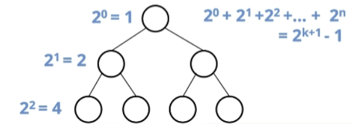
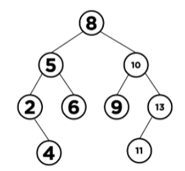

# [자료구조] Tree

## **트리란?**
- 노드들이 나무 가지처럼 연결된 **비선형(non-linear)**, **계층적** 자료 구조
- 한 노드가 여러 노드를 가르킬 수 있는 비선형적 자료구조
- List, Stack, Queue는 이전 데이터와 다음 데이터간의 순서가 존재
- But 트리 구조 특성상 순서는 그렇게 중요하지 않음
- **그래프의 일종**이며 데이터 구조의 **상하 개념 계층의 구조적 속성을 표현**한다는 특징이 있음

### **용어**


- **Node**: 트리 구조에서 각 **구성요소**(A ~ J)
- **Root Node**: 트리 시작 노드, 부모가 없는 **최상위 노드(A)
- **Edge**: 노드와 노드를 연결하는 선
- **Path**: 특정 노드에서 노드까지의 **경로**(순서)
- **Treminal Node(Leaf Node)**: **자식 노드가 존재하지 않는** 노드(H,I,J,F,G)
- **Sub-Tree**: 전체 큰 트리 구조 안의 작은 트리 구조<br>
    - 트리의 **재귀**적인 특성을 보여줌<br>
- **Depth**: **Root Node**로부터 얼마나 떨어져 있는 지를 뜻하는 단위<br>
    - 루트 노드의 바로 아래 노드의 depth = 1<br>
- **Level**: **같은 depth**를 가지는 노드들을 한 레벨로 나타내는 단위<br>
    - Root Node 기준, 이 위치를 level 0으로 잡음<br>
    - 루트 노드에서 어떤 노드까지의 **간선 수**<br>
- **Height**: 트리에서 가장 **최고 레벨**, 가장 깊은 층
- **Order**: 부모 노드에서 가질 수 있는 **최대 자식 수**<br>
    - e.g. If order 4 -> 부모 노드는 최대 3명의 자식 노드를 가질 수 있음<br>
- **Sibling관계**: 같은 부모를 가진 노드
- **degree**: 자식 수를 나타낸 차수<br>
    - Node D는 H, I의 부모 노드이며, degree = 2<br>


## 사용 예시
1. **계층적인 데이터 저장**
    - 데이터를 계층 구조로 저장 -> 파일이나 폴더와 같이 계층 구조를 갖는 곳에 사용<br>
2. **효율적인 검색 속도**
    - 효율적인 삽입, 삭제, 검색을 위해 사용<br>
3. **Heap(힙)**
    - **[Heap 정렬](Queue_Heap.md)**은 우선순위 큐에서 사용하는 정렬<br>
4. **DB 인덱싱**
    - DB 인덱싱을 구현하는 데 사용<br>
    - e.g. B-Tree, B+Tree, AVL-Tree<br>
5. **[Trie 자료 구조](Trie.md)**
    - Dictionary를 저장하는데 사용되는 특별한 종류의 트리<br>

## 트리 종류

### **Skew Tree(편향 트리 = 경사 트리)**
- 모든 노드들이 자식 노드를 **하나씩만** 가진 트리
- 아래 그림에서는 왼쪽 자식만 존재 -> left skew tree


### **Binary Search Tree(BST; 이진탐색트리)**
- <U>순서화된 이진 트리</U>
- **규칙**
    ```
    노드의 왼쪽 자식 값 < 부모 값
    노드의 오른쪽 자식 값 > 부모 값
    ```
### **m원 탐색 트리(m-way Search Tree)**
- 최대 m 개의 서브 트리를 갖는 탐색 트리
- <U>이진 탐색트리의 확장 형태</U> -> 높이를 줄이기 위해 사용

### **B-Tree(Balanced Tree, 균형 트리)**
- m원 탐색 트리에서 높이 균형을 유지하는 트리
- **height-Balanced m-way tree**라고도 함


### **Binary Tree(이진 트리)**
#### **특징**
- 각 노드가 최대 2개(0 - 2)의 자식 노드를 가진 트리
- 자식 노드에는 왼쪽 자식 노드와 오른쪽 자식 노드가 있으며, 이 둘은 엄연히 다른 노드
- 최대 2개라는 것 = **없을 수도(0)**있고 **1개만** 있을 수도 있다


#### **이진트리 유형**
1. **정 이진 트리(full binary tree) or 엄격한(Strict) 이진트리**
: **모든 노드가** <U>2개의 자식</U>을 가지는 트리(즉, 자식 노드가 1개인 노드가 아예 없어야 만족)
    ```
    왼쪽 그림은 자식 노드가 하나인 노드가 존재 -> 정 이진 트리 X
    오른쪽은 자식 노드가 하나인 노드 존재 X -> 정 이진 트리
    ```


2. **Perfect Binary Tree(포화 이진 트리)**
: 모든 노드가 2개의 자식을 가지고 **leaf 노드가 모두 같은 레벨인 트리**
- **높이가 h**일 때,
    - **노드 갯수** = 2^(k+1) - 1개를 가짐<br>
    - **Leaf Node 갯수** = 2^h개<br>




3. **Complete Binary Tree(완전 이진 트리)**
: 아래 두 조건을 모두 만족하는 트리
    - 마지막 레벨을 제외하고 모든 노드가 채워진 트리 구조<br>
    - 노드는 왼쪽에서 오른쪽으로 채워져야 함<br>
- 아래 두 개는 모두 완전 이진 트리
- If 왼쪽 그림에서 Level 1의 오른쪽 노드의 자식 노드가 오른쪽이라면? 완전 이진 트리 X


```
포화 이진 트리는 완전 이진트리의 조건을 모두 만족
-> 포화 이진 트리는 완전 이진 트리에 속함
명제의 역은 무조건 성립하는 것이 아님
```
#### **1차원 배열로 표현하는 이진 트리**
: 트리는 **선형 구조**인 **1차원 배열**로 표현 가능


- 왼쪽 트리는 **Level 순**, 그 이후엔 **왼쪽에서 오른쪽 순서**로 각 노드에 index를 붙여 표현 가능
- So, **완전 이진 트리**는 위의 그림과 같이 <U>배열을 빈틈없이 모두 채울 수 있음</U>

[추가 이해를 위한 그림]


- 완전 이진 트리는 왼쪽 -> 오른쪽으로 채워진다.
- <U>경사 이진 트리</U>는 배열에 빈 공간이 발생 -> 불필요한 공간이 낭비될 수 있고 배열 크기를 넘어가는 노드를 추가할 수 없다는 점이 단점

[중간이 비어있는 경우]


- 중간이 비어 있는 트리의 경우, 배열 사이에 null값이 들어간 구조로 나타남
- 배열을 사용할 때, **0번 index는 비우고 1번 index부터 Root Node를 채움** -> 이유: 탐색을 쉽게 하기 위함

#### **이진트리 속성으로 정해지는 배열의 인덱스**
|           루트 노드 인덱스가 1        |          루트 노드 인덱스가 0           |
|:------------------------------------:|:-------------------------------------:|
| | |

- 중간이 비어있는 트리 구조에서 6의 index 찾기
    - 6 = 노드 3의 왼쪽 자식 노드<br>
    - 표의 3번째 식 사용 -> 3 * 2 = 6
    - So, 6의 index = 6

- 이진 트리를 구현함에 있어 **노드를 사용** -> left 노드와 right 노드를 통해 구현

```java
class Node{
    int data;
    Node left;
    Node right;
}
```


- **연결 리스트**를 사용하면 배열보다 access 속도는 느림
- But, 삽입, 삭제가 쉽고, 노드를 포인터로 연결하는 개념이기에 노드 수 제한 X

#### **이진 트리 응용**
1. **Heap**
2. **Binary Search Tree**
3. **B-Tree**: 이진 트리의 응용으로 DB나 파일 시스템에 사용되는 중요한 구조
4. **AVL Tree**: Adelson-Velsky and Landis에서 따옴
5. **Expression Tree**
6. **Huffman Coding Tree**
7. **PQ(우선순위큐)**

#### **이진 트리 기본 연산**
- 트리도 자료 구조 So, 다른 구조들과 동일하게 아래와 같은 연산 가능
    - 트리에 데이터 삽입<br>
    - 데이터 삭제<br>
    - 데이터 검색<br>
    - 트리 탐색<br>

### **트리 순회**
: 트리 구조에서 각 노드를 한 번씩 방문하는 과정

#### **트리 순회 방법**


1. **Preorder(전위)**
- (pre-) 노드를 먼저 방문 -> 왼쪽 서브 트리를 preorder(재귀호출) -> 오른쪽 서브 트리를 preorder
- 노드방문, 왼쪽 서브트리 preorder, 오른쪽 서브트리 preorder 모두 만족해야함.
- **순서**: <U> A - B - D - H - E - C - F - I - J - G - K </u>
    - A 노드 방문
        - 왼쪽 서브 트리인 B 노드 방문
            - 왼쪽 서브 트리인 D 노드 방문
            - D노드는 왼쪽 노드가 없고 오른쪽 노드만 존재 H 노드 방문
            - H노드는 leaf노드이며 preorder 완료 -> D노드도 자동 완료
            - D노드는 B의 왼쪽 노드 -> B의 오른쪽 노드 E노드 방문<br>
    ...

2. **Inorder(중위)**
- 왼쪽 서브 트리를 inorder -> 중간에 **(루트)노드** 방문 -> 오른쪽 서브 트리를 inorder(재귀적으로)
- 중위 탐색에서는 왼쪽 서브트리인 D부터 시작
- **순서**: <U> D - H - B - E - A - I - F - J - C - G - K </U>

3. **Postorder(후위)**
- 왼쪽 서브 트리를 postorder -> 오른쪽 서브 트리를 postorder -> **(루트)노드** 방문
- 후위 탐색에서는 왼쪽과 오른쪽 트리를 모두 탐색한 후에 노드를 방문할 수 있기 때문에 A 노드가 가장 마지막에 방문한 것이 됨
- **순서**: <U> H - D - E - B - I - J - F - K - G - C - A </U><br>
<I>※ 재귀호출로 계속 반복하며 후위를 진행</I>

### **Binary Search Tree(BST; 이진탐색트리)**
: 트리 구조 자체적으로는 **데이터의 특성에 아무런 제약이 걸리지 않음**
So, 트리 노드를 하나하나씩 방문하여 탐색해야 하기 때문에 시간 복잡도 측면에서 큰 이점을 얻지 못함
-> 더 **빠른 탐색을 위해** <U>데이터 특성에 제약을 줌으로</U> Binary Search와 마찬가지로 O(log_(2)n)의 시간 복잡도를 가지며 나온 것이 **Binary Search Tree**라고 할 수 있음.

#### **이진 탐색 트리 특징**
- 이진 탐색 트리도 **이진 트리**구조
- 노드의 왼쪽 서브 트리 값 < 루트 노드 값
- 노드의 오른쪽 서브 트리 값 > 루트 노드 값
- 서브 트리 또한 **이진 탐색 트리 구조**
- **중복된 값은 일체 없다**

#### **이진 탐색 트리 방식**


- 루트 노드(5)를 기준으로 왼쪽 서브 트리에는 5보다 작은 수
- 루트 노드(5)를 기준으로 오른쪽 서브 트리에는 5보다 큰 수
- 하위의 서브트리도 왼쪽은 작은 수, 오른쪽은 큰 수
- **트리의 최솟값**: 트리 구조의 가장 왼쪽 끝에 위치한 노드가 최솟값
- **트리의 최댓값**: 트리 구조의 가장 오른쪽 끝에 위치한 노드가 최댓값
- If 사진의 트리 구조를 중위 탐색한다면?
    - 오름차순으로 숫자를 가져올 수 있음<br>
    - 중위탐색: 1 - 2 - 3 - 4 - 5 - 6 - 7 - 8 - 9<br>
- **이진 탐색 트리**는 <U>중위 탐색</U>을 하면 **오름차순으로 인덱스를 탐색 할 수 있음**

#### **이진 탐색 트리 생성**
: 데이터의 크기를 비교해 가면서 노드를 추가해 나감.
    ```
    [50, 15, 62, 80, 7, 54, 11]
    ```
1. 50이 배열의 첫 번째 데이터 -> 루트 노드로 트리에 삽입
2. 다음 요소를 계속해서 읽고 해당 노드가 루트 노드 요소보다 작으면 왼쪽 하위 트리의 루트로 삽입
3. 그렇지 않으면 오른쪽 하위 트리의 오른쪽 루트로 삽입


#### **이진 탐색 트리 삽입**
: 기존의 이진 탐색 트리에서 삽입하는 과정은 굉장히 중요

**과정**
- 해당 데이터가 자신이 들어갈 위치를 찾기
- 중복된 데이터는 삽입 X(**이진 탐색 트리는 중복이 없기 때문**)
- If 숫자 삽입 시도 -> 탐색 -> 같은 숫자 발견 -> 종료
- 데이터를 삽입하거나 삭제하더라도 특성이 유지되어야 함
- 추가된 노드는 트리의 **leaf 노드**에 삽입해야함
    - Why? **이진 트리의 특성 상 자식 노드가 3개를 넘으면 안 되기 때문**<br>

- e.g. 1이라는 데이터를 위 이진 탐색 트리에 삽입하고자 함.



    1. 먼저 루트 노드(8)과 비교
    2. 왼쪽 노드(5)와 비교
    3. 왼쪽 노드(2)와 비교
    4. 2와 비교했을 때 작으므로 왼쪽 노드

#### **이진 탐색 트리 삭제**
: 트리 구조 중간에 위치한 노드도 삭제될 수 있기에 고려할 것이 많음

**과정**
- 삭제 데이터 위치 찾기, 이때 데이터 위치 세 가지로 나뉘어짐
1. 삭제할 데이터가 leaf인 경우
2. 한 개의 자식 노드를 가질 경우
3. 두 개의 자식 노드를 가질 경우


1. 삭제할 데이터가 leaf인 경우 = 2, 8 의미
    - null을 부모 노드에게 리턴 -> 자신을 가리키던 자식 포인터를 null로 변경

2. 한개의 자식 노드를 가질 경우 = 1을 예시
    - **해당 노드의 자식 노드를** 1의 부모 노드였던 3의 자식 노드를 가리키던 포인터와 연결시켜 주면 됨


3. 두 개의 자식 노드를 가질 경우
3-1. **왼쪽 서브 트리의 최댓값과 교체**
3-2. **오른쪽 서브 트리의 최솟값과 교체**

**3-2 과정**
    <U>※ 오른쪽 노드의 최솟값, 즉 inorder 순회에서 다음 노드가 successor 노드</U>
    1. 삭제할 노드를 찾기
    2. 삭제할 노드의 successor 노드를 찾기
    3. 삭제할 노드와 successor 노드의 값을 변경
    4. successor 노드 삭제(연결 끊기)


- 7의 오른쪽 서브 트리에는 8, 9 존재 -> 최솟값(successor 노드: 8)과 삭제하고자하는 7을 교체


- 8이라는 데이터가 중복 -> leaf 노드의 8을 지움
- 1번 방법으로 null 대입 -> 삭제


#### **이진 탐색 트리 탐색**

**과정**
1. 루트에서 출발
2. 검색 값을 루트 노드와 비교
    - 루트 > 검색값 -> 왼쪽에 대해 재귀 호출<br>
    - 루트 < 검색값 -> 오른쪽에 대해 재귀 호출<br>
3. 일치하는 값을 찾을 때까지 절차를 반복
4. 검색 값이 없다면 null 반환

#### **이진 탐색 트리 구현**

<details>
<summary> 구현 코드 </summary>

- **ITree 인터페이스**

```java
package tree;

public interface ITree<T>{
    void insert(T val);
    void delete(T val);
    boolean contains(T val);
    int size();
}
```

- **BinarySearchTree 클래스**

```java
package tree;

import java.util.List;

public class BinarySearchTree<T extends Comparable<T>> implements ITree<T>{
    ...
}
```

- **Node Class**

```java
private class Node{
    T data;
    Node left;
    Node right;

    Node(T data){this.data = data;}

    Node(T data, Node left, Node right){
        this.data = data;
        this.left = left;
        this.right = right;
    }
}
```

- **멤버 변수**: 루트 노드를 가리키는 변수와 트리 구조 크기를 나타내는 변수 size 선언

```java
private Node root;
private int size;
```

- **생성자**: 루트 노드가 시작이기에 값에 null 대입 & size = 0으로 초기화

```java
public BinarySearchTree(){
    this.root = null;
    this.size = 0;
}
```

- **min(), minNode()**: 트리 데이터 중 최솟값을 찾아주는 메소드<br>
**가장 왼쪽**의 값을 가져오는 것 So, 루트 노드부터 시작해서 left 자식 노드를 계속 타고 들어가서 가장 마지막 값을 반환

1. **minNode()**:
    - minData에는 최솟값을 계속해서 업데이트
    - 반복문을 통해 left노드가 null일 때까지 반복
    - 반복문 안의 내용은 현재의 노드를 left노드로 계속해서 초기화 하면서 타고 들어가며, 각 노드의 데이터를 minData변수에 업데이트
    - 반복문이 끝났을 때는 더 이상 타고 들어갈 곳이 없는 가장 왼쪽 노드의 값을 가져옴

2. **min()**
    - 루트 노드부터 시작해서 타고 내려가기 때문에 인자로 루트 노드를 넘겨 minNode()의 리턴값을 리턴

```java
public T min(){
    return this.minNode(this.root);
}

private T minNode(Node node){
    T minData = node.data;
    while(node.left  != null){
        minData = node.left.data;
        node = node.left;
    }
    return node;
}
```

- **max(), minMax()**
: max() 메소드는 최댓값을 찾는 것이므로 방향만 바꾸어 **가장 오른쪽 값**을 가져오도록 함

```java
public T max(){
    return this.maxNode(this.root);
}

private T maxNode(Node node){
    T maxData = node.data;
    while(node.right != null){
        maxData = node.right.data;
        node = node.right;
    }
    return node;
}
```

- **전위 탐색 - preOrder()**
    - visited = 노드가 방문했음을 기록하는 리스트 객체, 방문한 node의 데이터를 반복적으로 넣음
    - 왼쪽 서브트리에 대해 반복적으로 재귀 호출을 진행 -> 완료
    - 오른쪽 서브트에 대해 반복적 재귀 호출
    - if문으로 node가 null일때(leaf 노드의 다음 노드를 방문 시) return 하여 종료하도록 메소드 가장 앞에 작성
    - 재귀 호출을 통해 left에 대한 탐색이 모두 종료가 되어야 return visited를 하면서 종료 -> 자연스럽게 right에 대한 재귀 탐색
**순서**
1. 노드 방문
2. 왼쪽 서브 트리 preorder
3. 오른쪽 서브 트리 preorder

```java
public List<T> preOrder(){
    return this.preorderTree(this.root, new ArrayList<>());
}

private List<T> preorderTree(Node node, List<T> visited){
    if(node == null) return visited;

    visited.add(node.data);
    preorderTree(node.left, visited);
    preorderTree(node.right, visited);

    return visited;
}
```
</details>