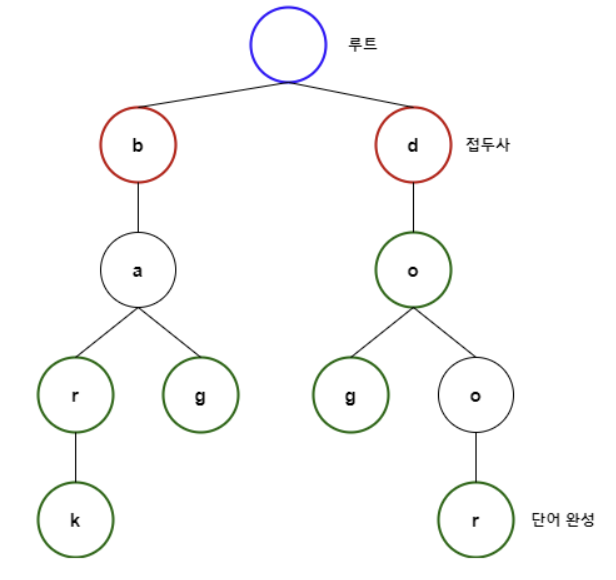

# [자료구조] Trie

## **Trie란?**
: 효율적인 문자열 저장 및 탐색이 가능하도록 만든 자료구조 형태 중 하나

### 사용예시
e.g. 수많은 문자열을 저장한 후 어떤 문자열을 입력받았을 때, 해당 문자열이 내가 저장한 구조에 포함된 문자열인지의 여부를 파악할 때 사용할 수 있는 방식
1. **단순비교**: 전체 문자열을 맨 앞부터 끝까지 각 문자를 비교하는 방식
2. **Binary Search**: 전체 문자열을 사전 순으로 배열 저장 -> 중간 값과 비교하여 정렬
3. **Trie**
- K-진 Tree 구조를 통해 문자열을 저장하는 방식
- 영사전의 방식 차용
    
    ```
    absent라는 단어 찾는다면? a찾기 -> b -> s -> e -> n -> t를 찾는 방식
    이를 Tree 형식으로 구현한 것
    ```
    
- **Prefix-Tree(접두사 트리):** 맨 앞의 접두어부터 시작하여 단어 전체를 찾아가는 과정
- 문자열 저장을 위한 공간 소모는 큼 But 탐색에는 효율적
- 최대 문자열 길이가 m일때, 문자의 갯수와 무관하게 **시간 복잡도 = O(m)**
    - 각 문자 하나를 배열의 위치로 지정하여 문자열 하나를 찾을 때 O(1)<br>
    - 만약, 문자열 길이가 너무 커서 Map 구조를 사용하여 동적 할당을 해야 하는 경우에는 **O(mlog_(2)n)**을 요구할 수도 있음<br>

- **예시**
아래 문자열 6개가 담긴 배열을 K-진 트리 형태 구조로 표현한다고 생각

```java
['bar', 'bag', 'bark', 'dog', 'do', 'door']
```



### 관련 문제
백준 5670 - https://www.acmicpc.net/problem/5670

#### **Trie 구현**
<details>
<summary> 구현 코드 </summary>

```java
// 생성자
public class Trie{
    Node root;
    static final int ALPHABET_SIZE = 26; // a-z는 26개
    public Trie(){
        this.root = new Node();
        this.root.val = '';
    }

    // 루트 노드에는 어떠한 문자열도 포함하지 않고 모든 문자열의 접두사를 자식 배열로 갖고 있음
    // 노드 클래스에는 문자열이 완성되는가의 여부를 묻는 변수도 저장
    private static class Node{
        Node[] child = new Node[ALPHABET_SIZE]; // 뒤로 연결되는 문자열 a-z 소문자를 index화하여 저장하는 배열(26개)
        boolean isTerminal = false; // 현재 노드가 문자 완성이 되는 노드인지 여부
        int childNum = 0; // 현재 노드에 연결된 문자열의 개수
        char val; // 현재 노드의 값
    }
}

// 삽입 - Insert

private in charToInt(char C){
    return c -'a'; //소문자만 있으므로 'a'를 빼면됨
}

public void insert(String str){
    int length = str.length();
    Node current = this.root; // 루트부터 시작해서 내려감
    for(int i = 0; i < length; i++){
        char c = str.charAt(i); // 전체 문자열의 일부 단어 추출
        int num = this.charToInt(c); // 추출 단어 -> 숫자로 변환

        if(current.child[num] == null){ 
            // 기존에 null이면 연결 문자열로 처음 추가 되는 것
            current.child[num] == new Node();
            current.child[num].val = c;
            current.childNum++;
        }

        current = current.child[num]; // 자식노드로 넘어감
    }
    current.isTerminal = true;
}

// find: 반복문으로 노드를 순환하여 문자열 존재 여부 판단
public boolean find(tring str){
    int length = str.length();
    Node current = this.root; // 현재 노드 설정

    for(int i = 0; i < length; i++){
        char c = str.charAt(i);
        int num = this.charToInt(c);
        if(current.child[num] == null){
            return false;
        }
        current = current.child[num];
    }
    // 문자열의 마지막이라면 True
    return current != null && current.isTerminal; 
}
```

- **delete**: 재귀적으로 Bottom-up 방식을 사용합니다.
과정은 다음과 같이 진행
1. 삭제할 문자가 다른 문자의 접두사인 경우: isTerminal을 false로 변경
    - Do는 Door의 접두사가 됨. So, Do를 삭제하면 D, o 에서 o에 isTerminal만 false로 변경<br>
    - 단순히 삭제하면 Door 또한 사라지게 된다.<br>
2. 삭제할 문자가 Unique하여 다른 문자와 연관이 없는 경우 - 관련 모든 노드 삭제
3. 삭제할 문자의 일부가 전체 삭제 문자의 접두사인 경우 - 다른 문자에 영향가지 않는 곳까지만 삭제
    - If, Door를 삭제하려고 하면, Do가 있으므로 전체 삭제를 할 수 없고 Door에서 뒤의 o, r 만 삭제 할 수 있음.

```java
// 사용자 호출 시 사용하는 메소드
public void delete(String str){
    delete(this.root, str, 0);
}

// 내부적으로 재귀를 통해 삭제를 진행하는 메소드
private void delete(Node current, String str, int idx){
    int leng = str.length();

    // 자식이 없는데 string의 length의 끝까지 오지 않았다면 예외 발생
    // 끝까지 갔는데 해당 노드가 terminal가 아니었다면 해당 단어를 저장하지 않은 것이므로 예외 발생
    if((current.childNum == 0 && idx != leng) || (idx == leng && !current.isTerminal)){
        throw new NoSuchElementException("Value " + str + " does not exist in Trie");
    }

    // 문자열이 마지막에 다다른 경우
    if(idx == leng){
        current.isTerminal = false;

        // 자식이 없는데 문자의 마지막이었다면 해당 문자만 저장된 것이므로 null 처리
        if(current.childNum == 0){
            current = null;
        }
    }else{
        char c = str.charAt(idx);
        int num = charToInt(c);

        // 삭제 후 돌아오는 부분
        delete(current.child[num], str, idx+1);

        // child가 null 처리 되었다면 자식 노드 수가 하나 줄어든 것이므로 -- 처리
        if(current.child[num] == null) current.childNum--;

        // 현재 노드의 자식이 없고, 단어의 마지막도 아니라면 삭제해야 함
        if(current.childNum == 0 && !current.isTerminal){
            current = nul;;
        }
    }
}
```

</details>